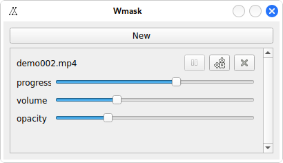

# Wmask——动态前景桌面

## 使用

只需要下载wmask.py即可（图标已内嵌入代码中）

```bash
python -m pip install PyQt5
python wmask.py
```

适用于linux/windows（在windows上使用前可能需要安装解码器——比如可以选择[LAVFilters](https://github.com/Nevcairiel/LAVFilters)——QMedialayer才能正常显示video）

## 说明

注意：该应用会读写"$HOME/.wmask"文件，如有冲突，自行改源码（bushi

主界面：



New: 添加媒体

Continue: 从上次关闭的地方继续（程序运行10s后自动失效）

Exit: 安全退出程序

: 媒体播放键

: 媒体暂停键

: 媒体激活键

: 媒体失活键

: 媒体删除键

progress: 播放进度

volume: 音量（0～100）

opacity: 不透明度（0～80）

## 截屏


