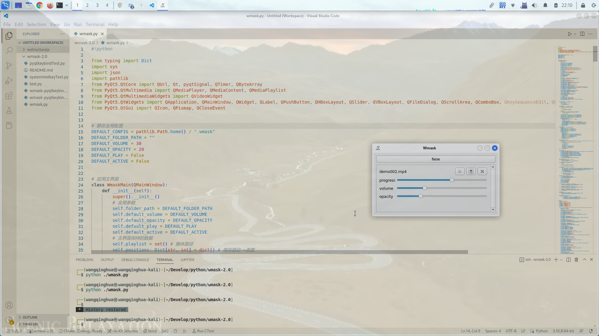

# Wmask——动态前景桌面

## 介绍

> ​	借助Qt，通过“全屏、无边框、带透明度、鼠标键盘事件穿透”窗体属性来使视频达到“动态前景桌面”的效果

主窗体：


> New: 添加媒体
>
> : 媒体播放键	/	: 媒体暂停键
>
> : 媒体激活键	/	: 媒体失活键
>
> : 媒体删除键
>
> progress: 播放进度
>
> volume: 音量（0～100）
>
> opacity: 不透明度（0～80）

截屏：



## 使用前说明

​	可以按需要选择Python（基于PyQt5）或C++（基于Qt5）版本，两者都可以跨平台使用。

​	C++版本可以自己编译，也可以在Releases中直接下载（windows是用MinGW编译的，linux是在Ubuntu22.04上编译的，两者都只适用于x86_64）。

​	由于QMediaPlayer自身没有解码功能，linux使用前需要安装`gstreamer`(通过这条命令安装：`sudo apt install gstreamer1.0-libav`)，windows使用前需要安装诸如[LAVFilters](https://github.com/Nevcairiel/LAVFilters)或[K-Lite Codec Pack](https://codecguide.com/download_kl.htm)这样的解码器。

## python版本使用

只需要下载wmask.py即可（图标已内嵌入代码中）

```bash
$ python -m pip install PyQt5
$ python wmask.py
```

## windows 使用

​	前往[Releases](https://github.com/wang606/Wmask/releases)下载window版本解压即可使用。如若在安装解码器后仍不能运行，请尝试自己构建。

## windows 构建

​	下载QtCreator，使用Qt5版本，下载本项目中的wmask文件夹，在QtCreator中导入项目`wmask.pro`，即可开始编译。

## windows 部署

​	从构建好的文件夹中复制wmask.exe到一个新的文件夹，然后在新文件中执行

```powershell
$ windeployqt.exe .\wmask.exe
```

注：windeployqt.exe的路径在Qt5目录下。

​	即可在新文件夹中部署好，如若有缺少dll文件，可去Qt5目录下寻找，复制进新文件夹即可。

## linux 使用

​	前往[Releases](https://github.com/wang606/Wmask/releases)下载linux版本解压即可使用。如若在安装解码器后仍不能运行，请尝试自己构建。

## linux 构建

​	依赖库：

```bash
$ sudo apt install build-essential cmake qtbase5-dev qtbase5-dev-tools qtchooser qt5-qmake qtdeclarative5-dev qtmultimedia5-dev
```

​	下载本项目的wmask文件夹，在文件夹中创建build文件夹，依次执行如下命令：

```bash
$ cd build
$ qmake ../
$ make
```

​	即可生成wmask可执行文件。

​	如果需要图形化编译体验：

```bash
$ sudo apt install qtcreator
```

​	然后在QtCreator中导入项目`wmask.pro`即可开始编译。

## linux 部署

​	我使用的是[linuxdeployqt](https://github.com/probonopd/linuxdeployqt)，但其限制了GCC版本为<=2.28，如果你的机器上GCC版本较高，则需要对其源码稍作更改并自己编译：

```bash
$ git clone [https://github.com/probonopd/linuxdeployqt](https://github.com/probonopd/linuxdeployqt) --depth=1
```

​	在下载源码中修改`tools/linuxdeployqt/main.cpp`文件，将其中的

```c++
if (strverscmp (glcv, "2.28")) >= 0) {
	qinfo() << "..."; 
}
```

代码块注释掉。

​	然后设置环境变量：

```bash
$ export PATH=/path/to/Qt5.x.x/bin:$PATH
$ export LD_LIBRARY_PATH=/path/to/Qt5.x.x/lib:$LD_LIBRARY_PATH
$ export QT_PLUGIN_PATH=/path/to/Qt5.x.x/plugins:$QT_PLUGIN_PATH
$ export QML2_IMPORT_PATH=/path/to/Qt5.x.x/qml:$QML2_IMPORT_PATH
```

​	在下载的linuxdeployqt文件夹中新建`build`文件夹，然后执行：

```bash
$ cd build
$ qmake ../
$ make
```

即可在`build/bin`目录中生成linuxdeployqt可执行文件。

​	剩下步骤可参考linuxdeployqt给出的[BUILDING.md](https://github.com/probonopd/linuxdeployqt/blob/master/BUILDING.md)文档进行，也即安装`patchelf`与`appimagetool`：

```bash
$ sudo apt install patchelf
$ sudo wget -c "https://github.com/AppImage/AppImageKit/releases/download/continuous/appimagetool-x86_64.AppImage" -O /usr/local/bin/appimagetool
$ sudo chmod a+x /usr/local/bin/appimagetool
```

​	然后就可以在构建好的wmask可执行文件所在文件夹中（建议复制到另外一个新的文件夹中）执行：

```bash
$ linuxdeployqt ./wmask -appimage
```

以生成可单独运行的文件夹。

